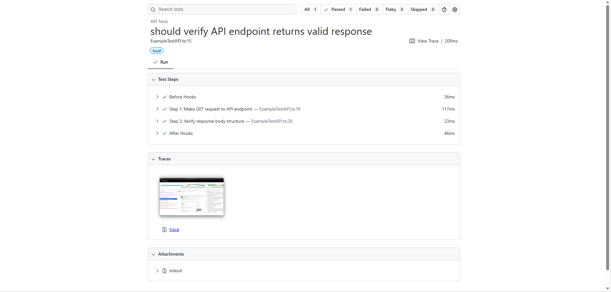
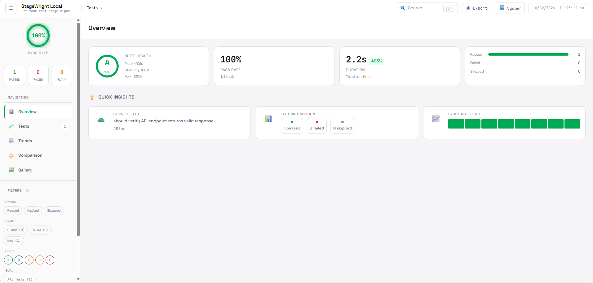

# Playwright TypeScript Test Framework

[](https://github.com/cmccarthyIrl/playwright-typescript-test-harness/actions/workflows/playwright.yml)

A comprehensive TypeScript-based test automation framework using Playwright with advanced reporting, logging, and Page Object Model patterns.

## 🚀 Features

- **TypeScript Support** - Full TypeScript integration with strong typing
- **Page Object Model** - Organized, maintainable test structure
- **Custom Fixtures** - Reusable page objects and test utilities
- **Multiple Reporters** - HTML, JUnit, Allure, and Smart Reporter
- **Advanced Logging** - Custom logger with file and console output
- **Parallel Execution** - Run tests across multiple projects
- **CI/CD Ready** - GitHub Actions integration
- **Screenshot & Video** - Automatic capture on failure
- **Multiple Browsers** - Chromium, Firefox, WebKit support
- **Code Quality** - ESLint and Prettier configuration

## 📋 Prerequisites

- **Node.js** >= 18.x
- **npm** >= 9.x
- **Allure** (optional, for Allure reports)

## 🔧 Installation

```bash
# Clone the repository
git clone <repository-url>
cd playwright-typescript-example

# Install dependencies
npm install

# Install Playwright browsers
npx playwright install
```

## 📁 Project Structure

```
playwright-typescript-example/
├── src/
│   ├── fixtures/           # Custom Playwright fixtures
│   │   └── PageFixtures.ts # Page object fixtures
│   ├── pages/              # Page Object Model
│   │   ├── BasePage.ts     # Base page with common methods
│   │   └── wikipedia/      # Wikipedia page objects
│   ├── tests/              # Test files
│   │   ├── ExampleTestAPI.ts  # API test examples
│   │   └── ExampleTestUI.ts   # UI test examples
│   └── utils/              # Utility classes
│       ├── AllureHelper.ts           # Allure reporting utilities
│       ├── Logger.ts                 # Custom logging utility
│       └── PlaywrightTestListener.ts # Custom test listener
├── reports/                # Test reports output
│   ├── allure-results/    # Allure test results
│   ├── playwright-report/ # HTML report
│   ├── smart-reports/     # Smart reporter output
│   └── test-results/      # Test artifacts & JUnit XML
├── logs/                   # Application logs
├── playwright.config.ts    # Playwright configuration
├── tsconfig.json          # TypeScript configuration
└── package.json           # Project dependencies
```

## 🧪 Running Tests

### Run All Tests

```bash
# Run all tests in headless mode (pipeline project)
npx playwright test --project=pipeline

# Run all tests in headed mode (local project)
npx playwright test --project=local
```

### Run Specific Tests

```bash
# Run tests by name pattern
npx playwright test --grep="Wikipedia Navigation Test"

# Run tests in a specific file
npx playwright test src/tests/ExampleTestUI.ts

# Run API tests only
npx playwright test src/tests/ExampleTestAPI.ts
```

### Run with Different Reporters

```bash
# Run with Allure reporter
npm run test-local-allure

# Run pipeline tests with Allure
npm run test-pipeline-allure
```

## 📊 Reporting

### HTML Report

```bash
# Open the last HTML report
npx playwright show-report reports/playwright-report
```



### Allure Report

```bash
# Generate Allure report
npm run allure:generate

# Open generated report
npm run allure:open

# Generate and serve report in one command
npm run allure:serve
```


### Smart Report

Smart reports are automatically generated at `reports/smart-reports/smart-report.html`



## ⚙️ Configuration

### Playwright Configuration

The framework uses two project configurations defined in `playwright.config.ts`:

- **local** - Headed mode with slow motion for local development
- **pipeline** - Headless mode optimized for CI/CD

### Test Matching

Tests are matched using the pattern `**/*Test*.ts`, so name your test files accordingly:
- `ExampleTestUI.ts` ✅
- `ExampleTestAPI.ts` ✅

### Environment Variables

Configure behavior via environment variables:
- `CI` - Set to enable CI-specific settings (retries, workers)

## 🧩 Writing Tests

### Page Object Pattern

```typescript
// src/pages/MyPage.ts
import { Page, Locator } from '@playwright/test';
import { BasePage } from './BasePage';

export class MyPage extends BasePage {
  readonly myButton: Locator;

  constructor(page: Page) {
    super(page);
    this.myButton = this.page.locator('#my-button');
  }

  async clickButton(): Promise<void> {
    await this.myButton.click();
  }
}
```

### Using Custom Fixtures

```typescript
// src/tests/MyTest.ts
import { expect } from '@playwright/test';
import { test } from '../fixtures/PageFixtures';

test('my test', async ({ wikipediaHomePage, page }) => {
  await wikipediaHomePage.navigate();
  expect(page.url()).toContain('wikipedia');
});
```

### Adding Steps with Screenshots

```typescript
await test.step('Step 1: Navigate to homepage', async () => {
  await page.goto('https://example.com');
  await testInfo.attach('step-1-screenshot', {
    body: await page.screenshot(),
    contentType: 'image/png'
  });
});
```

## 🔍 Code Quality

```bash
# Run ESLint
npm run lint

# Fix ESLint issues
npm run lint:fix

# Format and lint in one command
npm run check
```

## 🚀 CI/CD

The framework includes GitHub Actions workflow (`.github/workflows/playwright.yml`) for:
- Automated test execution
- Multiple browser support
- Artifact collection
- Report generation

## 📚 Documentation

Additional documentation is available in the `docs/` folder:
- [Getting Started Guide](docs/GETTING_STARTED.md)
- [Architecture Overview](docs/ARCHITECTURE.md)
- [Page Object Model Guide](docs/PAGE_OBJECTS.md)
- [Custom Utilities](docs/UTILITIES.md)
- [Reporting Guide](docs/REPORTING.md)

## 🤝 Contributing

1. Create a feature branch
2. Make your changes
3. Run `npm run check` to ensure code quality
4. Write/update tests for new features
5. Submit a pull request

## 📝 License

MIT

## 👥 Authors

Playwright TypeScript Example Team

---

For more information, visit the [Playwright documentation](https://playwright.dev/)
